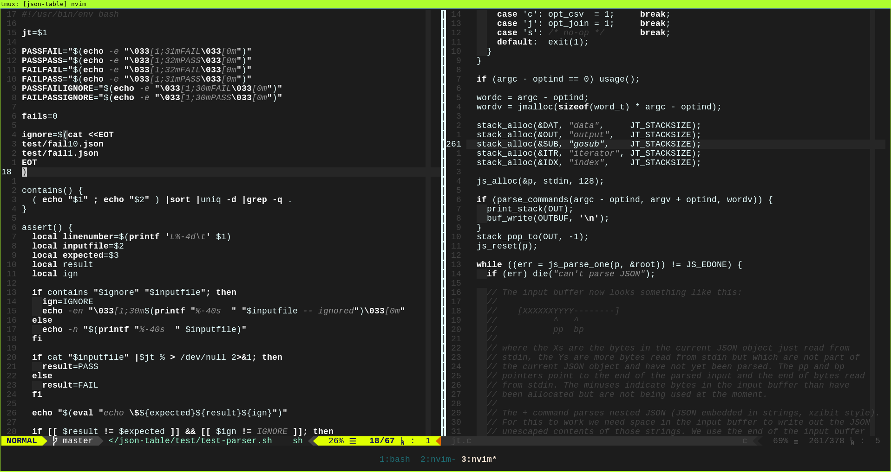
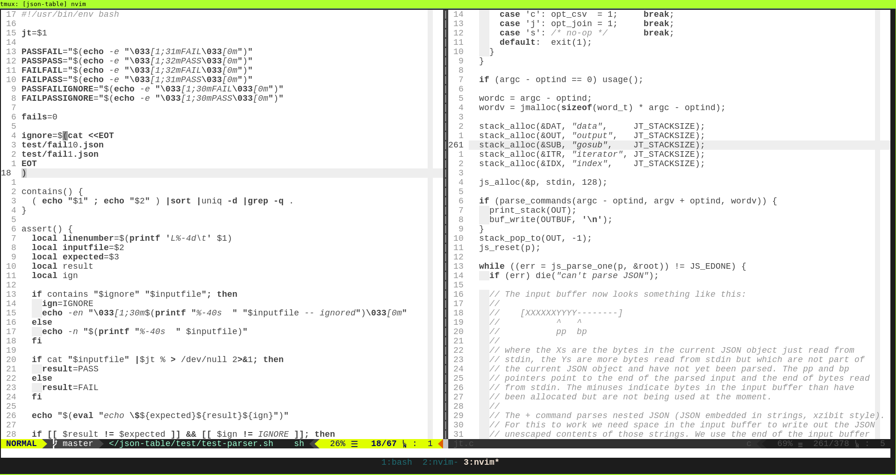

# vim-colors-off

Based on [vim-colors-off](https://github.com/pbrisbin/vim-colors-off).





## Installation

- Use [Vundle][]
- Add "micha/vim-colors-off" as a plugin

[vundle]: https://github.com/gmarik/Vundle.vim

## Usage

```
:colorscheme off
```

Supports both `background=light` and `background=dark`.
